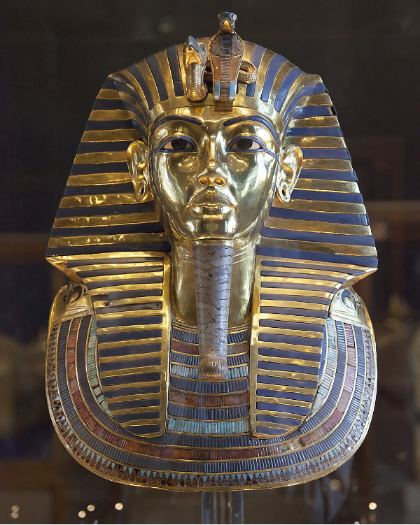
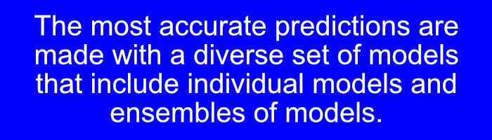
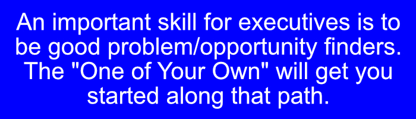
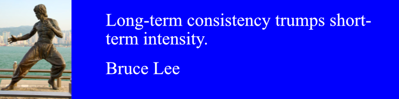

# Welcome!

Welcome to Ensembles! This book will guide you through the entire process of building your own ensemble models from beginning to end. It will also give you full access to the Ensembles package that automates the entire process.

I've done my very best to make the book very interesting, fun, and practical. There are lots of examples using real world data with all the steps included.

You will be able to do wonderful things as you complete the skills in this book. As the book will show, ensembles are much more accurate than any other method to help us understand and model nature. This will be done with a level of accuracy that has not been achieved previously. And you can do all of it.

The phrase "wonderful things" is very intentional. When Howard Carter was doing archaeology, at one point in November, 1922, he was quite sure he found something important. Carter made a small hole to see through. Lord Carnarvon (who was paying for all of this!) asked Howard Carter, "Can you see anything?. Howard Carter's famous reply, "Yes, wonderful things!". When they opened everything up, they found the intact tomb of Tutankhamun. It contained more than 5,000 items, and enriched our knowledge of ancient Africa beyond any other find.

Here is a tiny taste of one of the more than 5,000 the "wonderful things" found by Howard Carter, Lord Carnarvon, and the team of archaeologists.

I will do my very best to share many "wonderful things" through the entire book as you explore the world of ensembles.

The Ensembles package I've made does the entire analysis process for you automatically. This will put the power of ensembles in your hands, give you the strongest foundation for your work, with the highest degree of accuracy.

All of the examples in the book will come from real data. For example (and there are many more examples in the book):

• HR Analytics

• Predicting the winning time in the London Marathon

• World's most accurate score to a very difficult classification problem

• Beat the best score in student Kaggle competitions

We will have many more practical examples from a very wide range of fields for you to enjoy.

This book will show you how ensembles improve our understanding of nature, and how you can use ensembles in your work. The results using ensembles are much more accurate than has ever been possible before, and that will be demonstrated over and over again in this book. You will be able to use ensembles to understand the world, and build your own models of data, at a level of accuracy that has not been achieved before.

## Ensembles: The New AI, from beginner to expert

As you will see, Ensembles are the new AI. Science has gone from the calculus of Newton and Leibnetz, to differential equations, to the modern world of creating models, and many points in-between. Ensembles are the most powerful way to put models together to achieve the best possible results. This book will guide you through the process, and show you how you can build ensembles that will pass all testing.

This is the new AI. Welcome to the path, it's extremely fun, and I look forward to sharing it with you!

## What you will be able to do by the end of the book

• Make your own customized ensembles of models of numerical, classification, logistic and time series data.

• Use the Ensembles package which does the entire process automatically (but little customization is possible).

• Make your ensemble solutions into packages that can be shared with other users.

• Make your ensemble solutions into totally self-contained solutions that can be shared with anyone.

• Learn how ensembles of models can help to make the wisest possible decision based on the data.

• Learn how to present the results at different levels, from a regular user to a CEO and board of directors.

• How to present results that are social media friendly.

• Find your own data and create the ensemble solution from beginning to end (called One Of Your Own in the each of the chapter exercises)

• Solve real world examples in this book where ensembles achieve such results as:

• Beat the top score in a student data science competition by over 90% (numerical ensembles).

• Correctly predict the winning time for the 2024 Men's London Marathon (time series ensembles).

• Produce a 100% accurate solution to the dry beans classification problem (first in the world with this data set, done using classification ensembles).

• Make recommendations how Lebron James can improve his performance on the basketball court (logistic ensembles).

• Complete a comprehensive Final Project that will put all of your new skills with ensembles together. This result can be shared with employers, advisors, on social media, job interviews, or anywhere else you would like to share your work.

## How this book is organized so you learn the material as easily as possible

The book begins with the foundations of making ensembles of models. We will look at:

• Individual numerical models

• Ensembles of numerical models

• Individual classification models

• Ensembles of classification models

• Individual logistic models

• Ensembles of logistic models

• Individual forecasting models

• Ensembles of forecasting models

• Advanced data visualizations

• Multiple ways to communicate your results. This will range from other people in the field, to customers, to the C-Suite (CEO, CTO, board of directors, etc.)

• We will look at how to treat data science as a business. In particular we will pay close attention to showing return on investment (ROI) in data science, using ensembles of models.

• The book will conclude showing four examples of a final comprehensive project. There will be one example each of numerical data, classification data, logistic data and forecasting data. The example professionally formatted. The source files for each of the eight files are available in a github repository.

## How you can learn the skills as fast as possible: How the exercises are organized

As a young child, I learned that I have much better retention with a system I have always called delayed repetition. This means that I learn best and fastest when I see a worked out example, do several practice examples, and then repeat that after a delay in time. The delay can range from an hour to a few days.

For example, the exercises in the Individual Classification Models chapter will ask you to build models using techniques from the classification models and the prior chapters. The exercises for logistic ensembles will ask you to build models from the content in the logistic models chapter, and each of the previous chapters. It has been my experience that repeating this over and over is the fastest way for me to learn new content, and retain it for the longest period of time.

By the time you get to the Final Comprehensive Project, your skills will be sharp for each of the modeling techniques.

## Going from student to teacher: You are required to post on social media and help others understand the results

One of the most important parts of your role in data science is communicating your findings. I will present many examples of summaries and reports for you to adapt and use on your projects. You are also required to post your results on social media. You may use any appropriate choice of social media, but it needs to be publicly available. This has a number of very important benefits to you:

• You will build a body of work that shows your skill level

• The results will demonstrate your ability to communicate in a way that works with a wide variety of people

• You will work to demonstrate very good skills with video and/or audio production

• Use the hashtag #AIEnsembles when you post on social media

## Helping you use the power of pre-trained ensembles and individual models

Another important part of the skills you will learn here includes building pre-trained ensembles and models. The book will walk you through the process of building the pre-trained models and ensembles for each of the four types of data (numerical, classification, logicial, and time series).

## Helping you master the material: One of your own exercises

One of the differences with the exercises in Ensembles is the inclusion of One of Your Own exercises. Each set of exercises will include one which asks you to find your own data (with many hints given to help you find data), define the problem, make the ensemble, and report the results.

## Keeping it real: Actual business data and problems as the source of all the data sets

All of the data sets in this book use real data. No exceptions, no synthetic data. The sources of the data are all cited, and the real world implications can be found by a simple search. All of the data is absolutely real.

## Check your biases: Test your model on a neutral data set

Each set of exercises will ask you to check one of the trained models against a neutral data set. If the model has any biases, this should reveal them. Then you'll have the knowledge to go back and address the biases in the models.

## Helping you check your work—and verifying that your results beat previously published results

Many of the data sets have been solved by previous investigators (such as in competitions), so the results here can be easily compared with published results.

For example, we will look at the Boston Housing data set when we look at numerical data sets. This data set has been used many times in Kaggle competitions, published papers, and Github repositories, among many other sources.

The Ensembles package will automatically solve this data set, and return an RMSE less than 0.20 (there will be slight variation depending on how the parameters are set, as will be explained those chapters). In comparison, the Boston Housing data set was used in this Kaggle student competition: <https://www.kaggle.com/competitions/uou-g03784-2022-spring/leaderboard?tab=public>, and the best score was 2.09684. The Ensembles package will beat the best result in that Kaggle student competition by more than 90%. The Ensembles package only requires one line of code.

## Helping you work as a team with fully reproducible ensembles and individual models

A large part of the skills you will learn include how to make results that are reproducible. This will include:

• Multiple random resamplings of the data

• Learning how to test on totally unseen data for both individual and ensemble models

• How to repeat results (for example, 25 times), and report the accuracy of each resampling

For example, you will make ensembles of models, and then use those trained models to make predictions on totally unseen data.

## The Final Comprehensive Project will put everything together for you

As I was studying data science, one of my professors said that the papers I turned in were "good enough to show to the CEO or Board of Directors" of the Fortune 1000 company he worked for. The chapter on the Final Comprehensive Project will share the highest level of skills in the following:

• Truly understanding the business problem

• Being able to convey the very high value that data science brings to the table

• Being able to back up 100% of your claims with rock solid evidence, facts, and clear reasoning

• How to make a truly professional quality presentation worthy of the C-Suite

I've had the incredible pleasure of learning many different skills. A few include being able to play on more than 20 musical instruments, communicate in three languages at a professional level, manage a multi-million dollar division of a Fortune 1000 company, run two non-profit volunteer groups, snowboard a three mile run in Colorado, work as a professional counselor, and much more. The book your reading is only my most recent project. None of these skills were acquired overnight. A huge part of the success is being able to make slow and (usually) steady progress. The next chapter will reveal the big secret to getting results, but for now you are best off if you plan some regular time to work on the contents of the book.

Always remember to test everything, that will save you a ton of problems down the road.

## Exercises to help improve your skills

Exercise 1: Schedule regular time to work on this book

You will gain much more progress if you work at a steady pace. Take everything in small pieces. It's OK to go slow, as long as you keep going. Schedule regular time to work on this book, and you will get the largest possible reward for your efforts.

Exercise 2: Read each chapter at least twice **before** you begin working on the material.

Reading each chapter twice before you begin working on it will actually speed up your progress and results. It will actually take less time for you to complete the chapter. You might not believe it right now, but it's totally true.

Exercise 2a: Read a chapter ahead if you are able to do so.

Exercise 3: Read this chapter again
